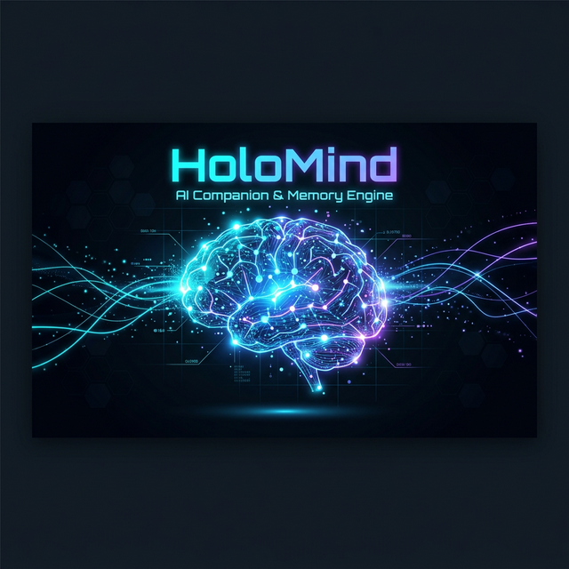
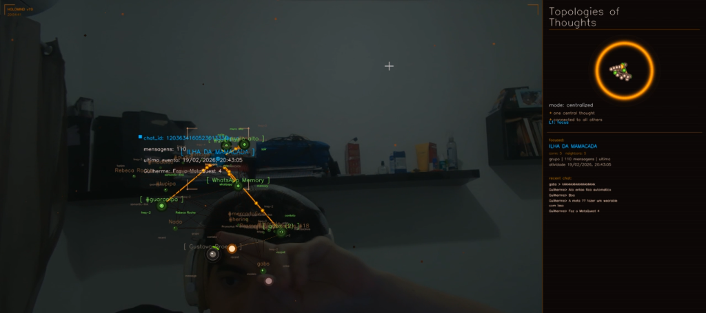
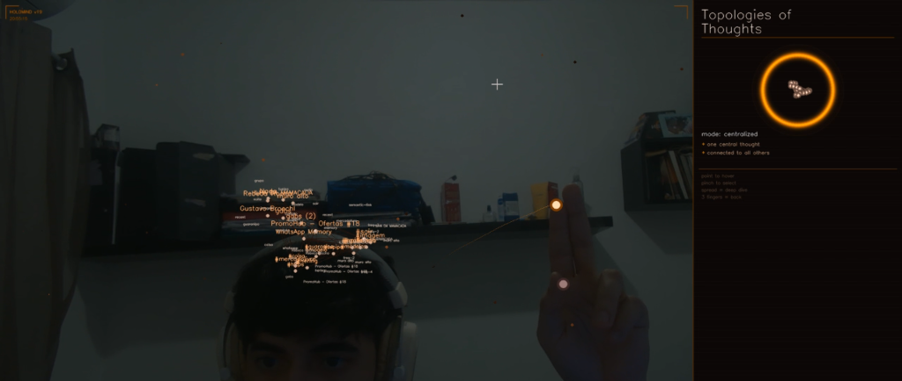

<div align="center">
  

  <h1>HoloMind v19 — Turbo Edition</h1>
  <p>Advanced AI Companion & Cognitive Memory Engine</p>

  <p>
    <a href="https://www.python.org/"></a>
    <a href="https://opencv.org/"></a>
    <a href="https://nodejs.org/"></a>
    <a href="https://openai.com/"></a>
  </p>
</div>

## 📌 Visão Geral

O **HoloMind** é um sistema conceitual avançado de inteligência artificial projetado para funcionar como um "Cérebro Estendido" (*Extended Brain*). Combinando LLMs (como GPT-4 e Gemini), renderização gráfica em tempo real usando OpenCV/MediaPipe, e um backend robusto em Node.js com integração nativa ao WhatsApp, o HoloMind é muito mais que um chatbot: é um motor cognitivo que pensa, lembra e visualiza seus dados em 3D.

Nesta arquitetura **Turbo Edition v19**, aplicamos micro-otimizações profundas no motor de renderização gráfica do Python que multiplicaram a performance do painel UI de 15FPS para fluidos 50-60FPS de processamento.

## 🚀 Principais Destaques

- **Arquitetura Poliglota (Python + Node.js):** 
  - **Motor Gráfico (Python):** Renderiza uma Interface Holográfica dinâmica (nós, conexões e partículas 3D projetadas na tela 2D) impulsionada pela biblioteca `OpenCV` e reconhecimento gestual utilizando o `MediaPipe` para interação imersiva *touchless* via webcam.
  - **Memory Bridge (Node.js):** Um servidor assíncrono rodando com `express` gerencia os tokens de eventos, conecta-se a LLMs (OpenAI/Gemini) e sincroniza a leitura e resposta de mensagens automatizadas no **WhatsApp**, lidando com dados contextuais e grafos de relação (memória).
- **Deep Optimizations (v19 Turbo):**
  - Implementação de cache (Pre-Bake) para a *Shell* em Âmbar e nós topológicos.
  - Redução massiva de latência computacional refatorando loops manuais em *numpy stride slices*.
  - Gestão de complexidade do MediaPipe alterada de `model_complexity=1` para `0`, resultando em reduções drásticas de tempo de frame (`-15ms/frame`) sem perde de precisão.
  - Uso de matrizes aditivas no `cv2.convertScaleAbs` substituindo floats caros por manipulações de bitmaps ultrarrápidas (`uint8`).
- **Engenharia de Memória Contextual:** Motor inteligente que indexa conversas e traça relações conceituais construindo dinamicamente *clusters* distribuídos sobre tópicos conversacionais ao vivo com usuários.

## 📸 Galeria & Interface em Ação

Abaixo estão capturas reais do sistema em execução, exibindo as topologias de memória e o rastreamento gestual (dedos guiando o cursor 3D) em tempo real via Webcam com overlay interativo:

<div align="center">
  
  <br><i>Navegação 3D baseada em gestos interagindo com nós de conhecimento.</i><br><br>
  
  
  <br><i>Detecção de Hand-Tracking (MediaPipe) em uso no ambiente real.</i>
</div>

## 📂 Arquitetura Técnica & Estrutura

- `main.py` e `memory_bridge.py`: Core do sistema cliente 3D e renderização gráfica interativa *Air-Touch*.
- `backend/`: Código de servidor em Node.js que instancia os clientes WhatsApp, gerencia o BD em JSON Memory Store e interfacêia com as APIs cognitivas.

A infraestrutura inteira foi modulada para suportar controle de concorrência massiva de instâncias de WhatsApp de forma *Stateless*, mantendo interações fluidas sob estresse.

## ⚙️ Como Executar Localmente

### 1. Inicializar o Backend (Node.js)
Este repositório está pronto para ser testado através do seu servidor REST.

```bash
cd backend
npm install
npm start
```

### 2. Inicializar a Interface Holográfica (Motor Python 3.10+)
Em um outro terminal, ative os requerimentos e execute o canvas visual.

```bash
pip install -r requirements.txt
python main.py
```

Sua webcam ligará e os pontos de rastreamento gestual (dedo indicador) comandarão o painel no ar. Navegue apontando para os *nós de ideias*.

## 👨‍💻 O Engenheiro Cog-Vision

**Gabriel Santana**  
Desenvolvedor Fullstack | [GitHub](https://github.com/gabsprogrammer) | [LinkedIn](https://linkedin.com)
